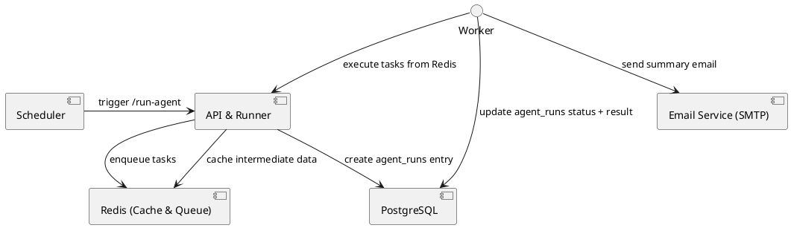

# AI Agent Workflow Backend

A minimal backend setup for running an AI agent every 10 minutes, persisting results, and emailing the top five outcomes. Designed as a self‑hosted MVP on a single instance and should be demo by the Debonairs brand in \dev-research\brand_repo.yaml only

## Table of Contents

* [Tech Stack](#tech-stack)
* [Prerequisites](#prerequisites)
* [Configuration](#configuration)
* [Architecture](#architecture)
* [Data Model](#data-model)
* [Workflow](#workflow)
* [Running the Scheduler](#running-the-scheduler)
* [Logging & Monitoring](#logging--monitoring)
* [Sprint Plan](#sprint-plan)
* [TODOs](#todos)
* [Coding Practices](#coding-practices)
* [License](#license)
## Tech Stack

* **Language & Framework:** Python 3.10 + FastAPI
* **ORM & Database:** SQLAlchemy + PostgreSQL (with JSONB)
* **Cache & Queue:** Redis (via RQ or Celery)
* **Scheduler:** APScheduler (in-app) or system cron
* **Email Delivery:** SMTP (e.g., SendGrid or local Postfix)
* **Configuration:** python-dotenv + environment variables
* **Containerization:** Docker & Docker Compose
* **Logging:** structlog (with file rotation or ELK integration)

## Prerequisites

* Linux server (Ubuntu 20.04+ recommended)
* Docker & Docker Compose installed
* Access to a PostgreSQL and Redis instance
* SMTP credentials for email delivery

## Configuration

All configuration values are read from environment variables. See `.env.example` for reference. Typical variables include `DATABASE_URL`, `LOG_LEVEL`, `REDIS_URL`, and `AGENT_RUN_INTERVAL_MINUTES` for the scheduler frequency.

## Architecture



Diagram: scheduling, task queuing, persistence, and email notification.

## Data Model

```sql
CREATE TABLE agent_runs (
  id            SERIAL PRIMARY KEY,
  started_at    TIMESTAMP NOT NULL DEFAULT NOW(),
  completed_at  TIMESTAMP,
  status        VARCHAR(20) NOT NULL,
  result        JSONB,
  error_message TEXT
);
```

* **agent\_runs**: records each run’s timestamps, status, JSON results, and any errors.

## Workflow

1. **Scheduler** triggers the `/run-agent` endpoint every 10 minutes.
2. **API runner** enqueues a task in Redis and inserts a new `agent_runs` row (`pending`).
3. **Worker** fetches the task, runs the agent logic, then updates `agent_runs` with `status`, `completed_at`, and the `result` JSON.
4. On success, the worker sends an email with the top five results.

## Running the Scheduler

The scheduler runs inside the FastAPI process using **APScheduler**. It is configured in `app/main.py` to call the `/run-agent` endpoint every `AGENT_RUN_INTERVAL_MINUTES` (default 10).

* **Cron job** (alternative):

  ```cron
  */10 * * * * curl -X POST http://localhost:8000/run-agent
  ```

## Logging & Monitoring

* Structured logs via `structlog` (JSON output for ELK).
* Log rotation: `logging.handlers.RotatingFileHandler`.
* Optional: forward logs to Elasticsearch/Kibana.

## Sprint Plan

Based on branch and current TO DO to review "Sprint Goals and Relevant Code Examples.md"

Following the guidance in `dev-research`, the first sprint will build a minimal
backend using **FastAPI**, **SQLModel**, **APScheduler**, and **RQ**. The goal is
to run the agent every 10 minutes, evaluate scraped content, and email the top
findings.

1. Set up the FastAPI project skeleton and define an `AgentRun` model with
   SQLModel so tables are created automatically on startup.
2. Load configuration from environment variables using `python-dotenv` and
   enable structured logging via `structlog`.
3. Expose a `/run-agent` endpoint and schedule it with APScheduler to enqueue
   jobs in Redis through RQ.
4. Implement an RQ worker that executes scraping and evaluation logic and
   updates `AgentRun` records.
5. Scrape targeted sites, evaluate content with the OpenAI API using brand
   settings from `dev-research/brand_repo.yaml`, and email a summary of the top
   five results.
6. Provide a lightweight endpoint to store yes/no feedback in SQLite.
7. Document how to run the scheduler, worker, and overall environment setup.

## Sprint 2: Proof of Concept Plan

Sprint Goal: To deliver a functional proof of concept that automates scraping GitHub for brand mentions, evaluating them with OpenAI, and sending a summary email with feedback links.

### Week 1: Core Feature Implementation
Focus: OpenAI Evaluation & Email Module (Estimated 5-8 hours)

- **Mon** Implement the `OpenAIEvaluator` class based on the provided code example.
  - Integrate the `openai` Python library.
  - Implement the `evaluate_text` method.
- **Tue** Develop a secure method for managing the OpenAI API key.
  - Use environment variables (`python-dotenv`) or a similar secrets management tool.
  - Update the configuration in `app/config.py` to load the key.
- **Wed** Implement the `EmailSender` class using the `smtplib` and `email` modules.
  - Create a basic HTML template for the email body.
  - Parameterize the template to accept the list of evaluated mentions.
- **Thu** Refine the HTML email for better readability and presentation.
  - Add basic styling (CSS) to the HTML for a professional look.
- **Fri** Conduct initial tests of the `EmailSender` with a mock email service to ensure emails are sent and formatted correctly.

Focus: Feedback Handling (Estimated 2-3 hours)

- **Fri** Implement the FastAPI feedback endpoint (`/feedback`) in `app/routes.py`.
  - Define the Pydantic model for the feedback data.
  - Create the database model for storing feedback in a separate SQLite database.

### Week 2: Integration, Testing & Finalization
Focus: Integration & End-to-End Workflow (Estimated 6-10 hours)

- **Mon** Integrate the `OpenAIEvaluator` and `EmailSender` into the main worker process in `app/worker.py`.
  - The worker should now perform the full sequence: scrape -> evaluate -> send email.
- **Tue** Connect the feedback endpoint to the main application and test the feedback loop.
  - Ensure that clicking a link in the email triggers the endpoint and saves the feedback.
- **Wed** Write unit tests for the new modules.
  - Create `tests/test_openai_evaluator.py` with mock API calls.
  - Create `tests/test_email_sender.py` to verify email construction.
  - Create `tests/test_feedback_routes.py` to test the feedback endpoint.
- **Thu** Perform comprehensive end-to-end testing of the entire system.
  - Run the scheduled job and verify the workflow from start to finish.
  - Check database entries, email content, and feedback logging.
- **Fri** Code cleanup, documentation updates, and final review before sprint conclusion.
  - Ensure the `README.md` reflects the final PoC state.
  - Add comments where necessary to clarify complex logic.
## TODOs

### Branch `backend-infra`

- [x] Initialize FastAPI project structure (`app/main.py`, `app/routes.py`).
- [x] Define `AgentRun` model with SQLModel and auto-create tables.
- [x] Set up environment configuration loader (`python-dotenv`) and structured logging (`structlog`).
- [x] Configure Redis with RQ and create the worker scaffold.
- [x] Schedule `/run-agent` using APScheduler to enqueue jobs.
- [x] Document scheduler setup and required environment variables.

-### Branch `scraper-email`

- [ ] Build scraping module (`scraper.py`) with retry logic.
- [ ] Load brand configuration from `dev-research/brand_repo.yaml`.
- [ ] Implement evaluation module using the OpenAI API.
- [ ] Compose summary email and send via SMTP with feedback links.
- [ ] Implement feedback receiver storing responses in SQLite.
- [ ] Write unit tests for scraping and email modules.

## **Coding Practices**

### **Fail Fast**

1. Validate configuration at startup  
   Check that all required environment variables (database URL, Redis connection, email credentials) are present before the application does any work. If any are missing, exit immediately with a clear error message. This prevents confusing runtime failures and makes setup issues obvious.  
2. Raise errors early  
   Instead of silently continuing when a step fails—such as when the web scraper cannot reach a site—raise an exception and log the problem. The README already recommends structured logging with `structlog`, so capturing errors early ensures they appear in the logs.  
3. Keep functions short and descriptive  
   Break logic into small, well-named functions. Each should do one thing so that even a non-coder can read the names and understand what the program is trying to do.  
4. Use clear, user-friendly logging  
   Combine fail-fast checks with simple log messages that explain what to fix (“SMTP credentials missing” or “Redis not reachable”). Avoid overly technical jargon so that it’s easy to diagnose problems without digging into the code.  
5. Document how to run and test  
   Provide step-by-step instructions in the README for starting the scheduler and how to see logs when something goes wrong. This supports a non-coder who may need to troubleshoot issues.


## License

MIT © Your Organization
