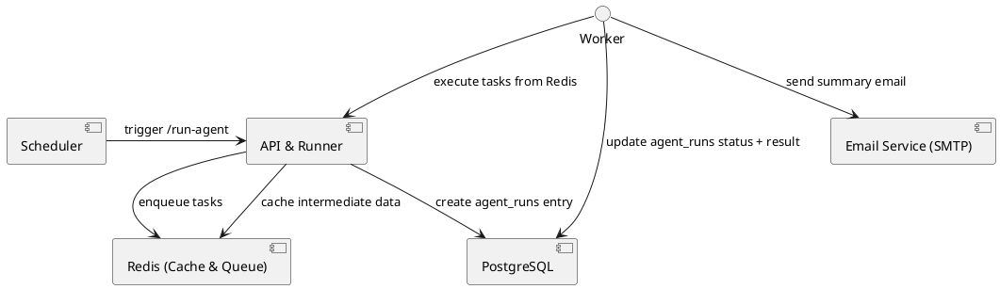

# AI Agent Workflow Backend

An automated backend for running AI agents on a schedule. It scrapes the web using configurable queries, evaluates findings with OpenAI, and emails a concise summary. Originally a simple brand monitor, the project now also surfaces broader market intelligence so you can track industry trends alongside brand health.

## Table of Contents

* [Tech Stack](#tech-stack)
* [Prerequisites](#prerequisites)
* [Configuration](#configuration)
* [Architecture](#architecture)
* [Data Model](#data-model)
* [Workflow](#workflow)
* [Running the Scheduler](#running-the-scheduler)
* [Logging & Monitoring](#logging--monitoring)
* [Data Acquisition Strategy](#data-acquisition-strategy)
* [Email Summary Report Structure](#email-summary-report-structure)
* [TODOs](#todos)
* [Coding Practices](#coding-practices)
* [License](#license)
## Tech Stack

* **Language & Framework:** Python 3.10 + FastAPI
* **ORM & Database:** SQLAlchemy + PostgreSQL (with JSONB)
* **Cache & Queue:** Redis (via RQ or Celery)
* **Scheduler:** APScheduler (in-app) or system cron
* **Email Delivery:** SMTP (e.g., SendGrid or local Postfix)
* **Configuration:** python-dotenv + environment variables
* **Containerization:** Docker & Docker Compose
* **Logging:** structlog (with file rotation or ELK integration)

## Prerequisites

* Linux server (Ubuntu 20.04+ recommended)
* Docker & Docker Compose installed
* Access to a PostgreSQL and Redis instance
* SMTP credentials for email delivery

## Configuration

 All configuration values are read from environment variables. See `.env.example` for reference. Typical variables include `DATABASE_URL`, `LOG_LEVEL`, `REDIS_URL`, `AGENT_RUN_INTERVAL_MINUTES`, and `OPENAI_API_KEY` for the scheduler frequency and API access. To customize scraping queries, copy `search_config.json.example` to `search_config.json` and adjust the `brand_health_queries` and `market_intelligence_queries` lists. When present, this file is automatically loaded by the worker to override dynamically generated search terms.

## Architecture



Diagram: scheduling, task queuing, persistence, and email notification.

## Data Model

```sql
CREATE TABLE agent_runs (
  id            SERIAL PRIMARY KEY,
  started_at    TIMESTAMP NOT NULL DEFAULT NOW(),
  completed_at  TIMESTAMP,
  status        VARCHAR(20) NOT NULL,
  result        JSONB,
  error_message TEXT
);
```

* **agent\_runs**: records each run’s timestamps, status, JSON results, and any errors.

## Workflow

1. **Scheduler** triggers the `/run-agent` endpoint every 10 minutes.
2. **API runner** enqueues a task in Redis and inserts a new `agent_runs` row (`pending`).
3. **Worker** fetches the task, runs the agent logic, then updates `agent_runs` with `status`, `completed_at`, and the `result` JSON.
4. On success, the worker sends an email with the top five results.

## Running the Scheduler

The scheduler runs inside the FastAPI process using **APScheduler**. It is configured in `app/main.py` to call the `/run-agent` endpoint every `AGENT_RUN_INTERVAL_MINUTES` (default 10).

* **Cron job** (alternative):

  ```cron
  */10 * * * * curl -X POST http://localhost:8000/run-agent
  ```

The API also exposes a `/health` endpoint that simply returns `{"status": "ok"}`.
This can be used by Docker or orchestration tools to confirm the service is running.

## Logging & Monitoring

* Structured logs via `structlog` (JSON output for ELK).
* Log rotation: `logging.handlers.RotatingFileHandler`.
* Optional: forward logs to Elasticsearch/Kibana.

## Data Acquisition Strategy

The scraper now primarily pulls data from Google Search Engine Results Page (SERP) snippets. This reduces direct load on external sites and helps avoid "Too Many Requests" errors while still generating search terms and analyzing the results as before.

## Email Summary Report Structure

The automated summary email sent after each agent run contains four sections:
1. **On brand specific links** - links that explicitly mention the brand. Each item includes "Yes, it was helpful! | No, it was not helpful." feedback options.
2. **Brand relevant but not brand specific links** - industry news or tangential mentions that may still be valuable.
3. **Prompt Engineering Metadata** - shows the exact prompts and search terms used so you can trace how the AI was instructed.
4. **Content Scraped Since last email** - logs scraping activity including the number of search calls, the timestamps of each search, and summaries of the pages visited.

Example:
```
Hi there,

Below are links that the AI thinks are on brand specific
http://brand.com (Yes, it was helpful! | No, it was not helpful.)

Below are 3 links that AI thinks are brand relevant but not brand specific
http://relevant.com

Prompt Engineering Metadata
Brand System Prompt: ...
Market System Prompt: ...
User Prompt: ...
Search Terms Generated: pizza, culture

Content Scraped Since last email
Number of search calls: 2
Searches run at: 11:01, 11:05
Summaries: summary text here
```


## General TODOs
- [x] Initialize FastAPI project structure (`app/main.py`, `app/routes.py`).
- [x] Define `AgentRun` model with SQLModel and auto-create tables.
- [x] Set up environment configuration loader (`python-dotenv`) and structured logging (`structlog`).
- [x] Configure Redis with RQ and create the worker scaffold.
- [x] Schedule `/run-agent` using APScheduler to enqueue jobs.
- [x] Document scheduler setup and required environment variables.
- [x] Build scraping module (`scraper.py`) with retry logic to gather a short sample of the internet (about 10 minutes of crawling as described in `dev-research/research_workflow_doc.md`) for interesting content relevant to the brand. Use lateral thinking when choosing search terms from `dev-research/brand_repo.yaml`.
- [x] Load brand configuration from `dev-research/brand_repo.yaml`.
- [x] Construct `debonair` brand YAML for testing using the values in `dev-research/brand_repo.yaml` (`dev-research/debonair_brand.yaml`).
- [x] Implement evaluation module using the OpenAI API (`app/openai_evaluator.py`).
- [x] Compose summary email and send via SMTP with feedback links.
- [x] Implement feedback receiver storing responses in SQLite.
- [x] Write unit tests for scraping and email modules.
- [x] Securely load OpenAI API key via app/config.py
- [x] Implement EmailSender class with HTML template and styling.
- [x] Add /feedback endpoint and SQLite model.
- [x] Integrate Scraper and Evaluator into the Worker: The main task remaining is to integrate the SimpleScraper and evaluate_content function into the app/worker.py's run_agent_logic function. The current run_agent_logic is a placeholder and needs to be updated to perform the actual scraping and evaluation.
- [x] Create a docker-compose.yml file: This is the most critical missing piece. The file must define the api, worker, db, and redis services, their builds, environments, and dependencies.
- [x] Unit tests for evaluator, feedback routes, and end-to-end workflow.
- [x] verify Email Content: The send_summary_email function in app/email_sender.py currently sends a generic list of results. This should be updated to use the actual evaluated content from the OpenAI evaluator.
- [x] Create a docker-compose.yml file: This is the most critical missing piece. The file must define the api, worker, db, and redis services, their builds, environments, and dependencies.
- [x] Create an .env.example template file: Create a template file that lists all the necessary environment variables but with placeholder values. This provides a clear guide for others on how to create their own .env file.Variables to include: POSTGRES_USER, POSTGRES_PASSWORD, POSTGRES_DB, OPENAI_API_KEY, and all MAIL_* settings.
- [x] write sample Dockerfile for local launch
- [x] Create a file named smoke_test.sh in your project's root directory as based on dev-research\smoke-test-suggestion.txt
- [x] Documentation updates and final cleanup.

## **Coding Practices**

### **Fail Fast**

1. Validate configuration at startup  
   Check that all required environment variables (database URL, Redis connection, email credentials) are present before the application does any work. If any are missing, exit immediately with a clear error message. This prevents confusing runtime failures and makes setup issues obvious.  
2. Raise errors early  
   Instead of silently continuing when a step fails—such as when the web scraper cannot reach a site—raise an exception and log the problem. The README already recommends structured logging with `structlog`, so capturing errors early ensures they appear in the logs.  
3. Keep functions short and descriptive  
   Break logic into small, well-named functions. Each should do one thing so that even a non-coder can read the names and understand what the program is trying to do.  
4. Use clear, user-friendly logging  
   Combine fail-fast checks with simple log messages that explain what to fix (“SMTP credentials missing” or “Redis not reachable”). Avoid overly technical jargon so that it’s easy to diagnose problems without digging into the code.  
5. Document how to run and test
   Provide step-by-step instructions in the README for starting the scheduler and how to see logs when something goes wrong. This supports a non-coder who may need to troubleshoot issues.
6. Consult dev-research links when relevant
   The `dev-research` folder lists articles and repositories that demonstrate best practices. These sites have been whitelisted in the Codex environment, so reference them whenever they directly support Sprint 2 objectives.


## License

MIT © Your Organization
