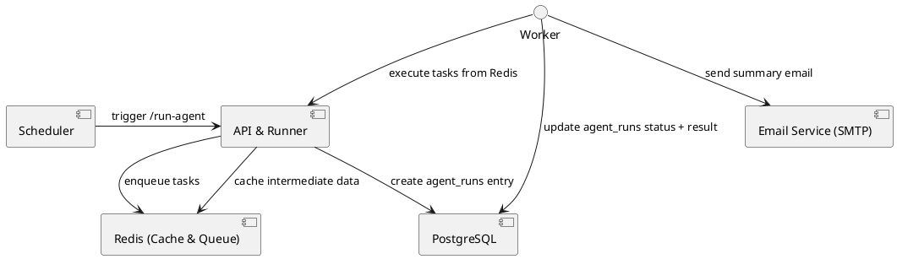

# AI Agent Workflow Backend

A minimal backend setup for running an AI agent every 10 minutes, persisting results, and emailing the top five outcomes. Designed as a self‑hosted MVP on a single instance.

## Table of Contents

* [Tech Stack](#tech-stack)
* [Prerequisites](#prerequisites)
* [Setup](#setup)
* [Configuration](#configuration)
* [Architecture](#architecture)
* [Data Model](#data-model)
* [Workflow](#workflow)
* [Running the Scheduler](#running-the-scheduler)
* [Logging & Monitoring](#logging--monitoring)
* [License](#license)

## Tech Stack

* **Language & Framework:** Python 3.10 + FastAPI
* **ORM & Database:** SQLAlchemy + PostgreSQL (with JSONB)
* **Cache & Queue:** Redis (via RQ or Celery)
* **Scheduler:** APScheduler (in-app) or system cron
* **Email Delivery:** SMTP (e.g., SendGrid or local Postfix)
* **Configuration:** python-dotenv + environment variables
* **Containerization:** Docker & Docker Compose
* **Logging:** structlog (with file rotation or ELK integration)

## Prerequisites

* Linux server (Ubuntu 20.04+ recommended)
* Docker & Docker Compose installed
* Access to a PostgreSQL and Redis instance
* SMTP credentials for email delivery

## Configuration

All configuration values are read from environment variables. See `.env.example` for reference.

## Architecture



Diagram: scheduling, task queuing, persistence, and email notification.

## Data Model

```sql
CREATE TABLE agent_runs (
  id            SERIAL PRIMARY KEY,
  started_at    TIMESTAMP NOT NULL DEFAULT NOW(),
  completed_at  TIMESTAMP,
  status        VARCHAR(20) NOT NULL,
  result        JSONB,
  error_message TEXT
);
```

* **agent\_runs**: records each run’s timestamps, status, JSON results, and any errors.

## Workflow

1. **Scheduler** triggers the `/run-agent` endpoint every 10 minutes.
2. **API runner** enqueues a task in Redis and inserts a new `agent_runs` row (`pending`).
3. **Worker** fetches the task, runs the agent logic, then updates `agent_runs` with `status`, `completed_at`, and the `result` JSON.
4. On success, the worker sends an email with the top five results.

## Running the Scheduler

* **APScheduler (in-app)**: configured in `scheduler.py`. Auto-start with the FastAPI app.
* **Cron job** (alternative):

  ```cron
  */10 * * * * curl -X POST http://localhost:8000/run-agent
  ```

## Logging & Monitoring

* Structured logs via `structlog` (JSON output for ELK).
* Log rotation: `logging.handlers.RotatingFileHandler`.
* Optional: forward logs to Elasticsearch/Kibana.

## License

MIT © Your Organization
